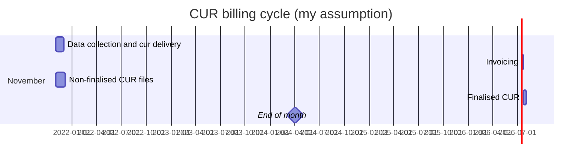

 #cur #finops 

# Finalised cur
 
 AWS creates its invoices in steps:
 - first, AWS collects the usage data in real-time. This is the information you have in the CUR during the month. 
 - second, after the month is over, usually during the fist week of the next month, AWS run all calculations for tiered services, like support. 

When the CUR is finalised, AWS generates a value for the [[bill_InvoiceId]]. I assume this comes from a separate system that does the second round of calculations and generates invoices. 

![[CUR billing cycle Gantt.png]]

---
If you are reading this from the website ignore the the image below. It looks great in the local obsidan - see the screenshot - but rubish in the web-published version.

