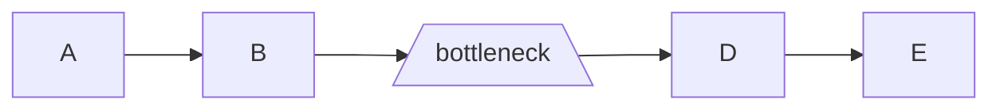

# Focus all your energy on the weakest link
#permanentnote

## Source
- [[book - the goal]]

## Keywords (topics and howto)
- [[topic - leading and managing]]
- [[topic - simplification]] as focus
- [[topic - supply chain]] this is a supply chain approach applied to strategy

## Relevant notes
- [[zt - do the next right thing]] is about morality and emotions, while this one is more about business and effect
- [[zt - the concept of strategy]] has a section at the bottom about executions and high-level principles of action and goes into much details around focus

## Notes
- When putting effort into any form of supply chain, it is important to focus exclusively on the weakest link as any imporvement before it will generate stock, and any improvement after the bottleneck will only be doing nothing better.

